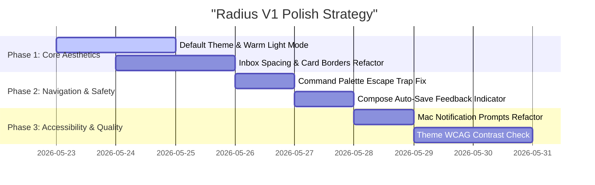

# UX Evaluation & Product Design Audit: Radius

A deep-dive, professional review of the **Radius** email client—evaluating usability, interaction design, visual hierarchy, accessibility, and architectural alignment against the core design philosophy of **"Warm Minimalist Calm."**

This audit establishes a quantitative usability baseline, catalogs outstanding design friction points, and provides a clear execution path to polish the product for a successful **V1 shipment**.

---

## Executive Summary & UX Score

Radius represents a beautiful, tactile alternative to the clinical, sterile interfaces of modern email. It treats the email reader not as an inbox scanner, but as a book reader, with gorgeous humanist typography and a focused, quiet layout.

However, several critical structural deviations, accessibility gaps, and visual inconsistencies currently dilute this calming premise. By addressing the prioritized backlog below, the team can transition Radius from a promising draft to a state-of-the-art native desktop utility.

### Quantitative Usability Score

### `76 / 100` — Solid Beta (Needs Polish)

```mermaid
radar
    title "UX Performance Matrix"
    "Visual Cohesion & Hierarchy": 16
    "Interaction Design & Feedback": 14
    "Information Architecture & Density": 17
    "Task Success & Flow Clarity": 15
    "Accessibility & Resilience": 14
```

| Vector | Score | Key Insights |
| :--- | :---: | :--- |
| **Visual Cohesion & Hierarchy** | `16 / 20` | Strong typographic hierarchy (Satoshi + Instrument Sans + Newsreader) and accent palette, but undermined by default theme setting and inconsistent card borders in the inbox list. |
| **Interaction Design & Feedback** | `14 / 20` | Smooth sidebar toggle transitions and smart 10s undo toasts. Friction points exist in command palette submenu navigation and notification prompt state logic. |
| **Information Architecture & Density** | `17 / 20` | Excellent centered reader column. However, showing hard-coded category tags in the inbox list introduces cognitive friction in a distraction-free client without filter views. |
| **Task Success & Flow Clarity** | `15 / 20` | Onboarding sync mode options are clear, but starting the connect flow lacks contextual speed estimations and a clear background progress indicator. |
| **Accessibility & Resilience** | `14 / 20` | Excellent keyboard shortcuts. Color contrast in dark theme requires adjustments to meet WCAG AA. No typographic control in reader view for low-vision users. |

---

## The Prioritized UX Backlog (V1 Ship Focus)

### Nature Classification
*   **UI Change (UI)**: Styling adjustments, visual hierarchy corrections, theme configurations.
*   **Bug Fix (BUG)**: Breaking interaction logic, keyboard focus issues, or state inconsistencies.
*   **Feature (FEAT)**: Missing essential flows or minor enhancements required to complete the UX loop.

---

### 1. Default Theme Discrepancy & Visual Overhaul 🔴 CRITICAL

*   **Nature:** `UI Change`
*   **Related File:** [App.tsx](file:///Users/dipxsy/Code/projects/radius/src/mainview/App.tsx#L927)
*   **Severity:** `🔴 Critical`
*   **What:** The `ThemeProvider` in `App.tsx` is hardcoded to default to `"dark"`, and `DEFAULT_THEME_ID` in `theme-registry.ts` targets `"dark"`.
*   **Why it matters:** The design system (`productDesign.md`) unequivocally positions Radius as a **warm, light-mode-first calm product** ("Radius owns warm, light-mode-first calm"). Starting in a stark dark theme immediately breaks the user's emotional association with the warm paper aesthetics of Nothing Light (`nothing-light.json`) or Gruvbox Light, forcing a clinical aesthetic instead of a welcoming "living room" feel.
*   **Heuristic Violated:** *Flexibility and Efficiency of Use / Consistency and Standards*
*   **Recommendation:**
    *   Change the hardcoded default theme inside `App.tsx` and `theme-registry.ts` to `"nothing-light"` or `"light"`.
    *   Ensure the application defaults to the warm paper-printed aesthetic that represents the soul of Radius.

---

### 2. Inbox Row Card Border visual drift 🟠 MAJOR

*   **Nature:** `UI Change`
*   **Related File:** [InboxList.tsx](file:///Users/dipxsy/Code/projects/radius/src/mainview/components/InboxList.tsx#L90-L95)
*   **Severity:** `🟠 Major`
*   **What:** The individual `EmailRow` component renders with a solid card height of `104px` with multi-line card hover elements.
*   **Why it matters:** The design specifications (`productDesign.md:144-145`) specify: **"Full-width rows, no card containers. No borders between rows — separation via 24px whitespace."** The current implementation has drifted into standard card rows with background highlights, increasing visual density and cluttering the scanning rhythm.
*   **Heuristic Violated:** *Consistency and Standards / Aesthetic and Minimalist Design*
*   **Recommendation:**
    *   Refactor the virtual item height and padding inside `InboxList.tsx` to align closer to a whitespace-driven list layout.
    *   Remove hard horizontal borders and card structures, replacing them with a larger vertical spacing rhythm that lets the typography breathe.

---

### 3. Command Palette Keyboard Trap & Submenu Navigation 🟠 MAJOR

*   **Nature:** `Bug Fix`
*   **Related File:** [cmd.tsx](file:///Users/dipxsy/Code/projects/radius/src/components/cmd.tsx#L68-L93)
*   **Severity:** `🟠 Major`
*   **What:** When navigating submenus in the Command Palette (e.g., Accounts, Themes, Mailboxes), pressing `Escape` closes the entire command palette dialog instead of stepping back one level to the "home" command screen, unless custom keyboard captures perfectly block the default Dialog overlays.
*   **Why it matters:** Users expect `Escape` to act as a stack pop—taking them back to the previous screen. Abruptly closing the palette forces them to reopen it and re-navigate, adding friction.
*   **Heuristic Violated:** *User Control and Freedom*
*   **Recommendation:**
    *   Optimize the keydown handler inside `cmd.tsx` to capture `Escape` events at the container level:
    ```typescript
    if (page !== "home") {
      e.preventDefault();
      e.stopPropagation();
      setPage("home");
      setSearch("");
      return;
    }
    ```
    *   Ensure the host `Dialog`'s `onEscapeKeyDown` is set to prevent default behavior when inside submenus.

---

### 4. macOS Notification Permission Flow Loop 🟠 MAJOR

*   **Nature:** `Bug Fix`
*   **Related File:** [notification-prompt.tsx](file:///Users/dipxsy/Code/projects/radius/src/components/notification-prompt.tsx#L47-L53), [App.tsx](file:///Users/dipxsy/Code/projects/radius/src/mainview/App.tsx#L380-L396)
*   **Severity:** `🟠 Major`
*   **What:** On macOS, notification setups are a multi-step flow. The "followup" banner correctly prompts users to set Radius to "Banners" in System Settings. However, the primary button CTA ("Try again") simply triggers `requestNotificationPermission` in `App.tsx` again.
*   **Why it matters:** Since macOS already processed the native dialog once, re-triggering the permission call does nothing. The user gets stuck in a loop wondering why clicking "Try again" doesn't do anything, until they manually click "Open settings."
*   **Heuristic Violated:** *Help Users Recognize, Diagnose, and Recover from Errors*
*   **Recommendation:**
    *   In `"followup"` mode, the primary button CTA should change its label to `"Open Settings"` and execute `openNotificationSettings()` directly, rather than loops of native permission requests.
    *   Remove the duplicate button and elevate "Open settings" to the primary action during followups.

---

### 5. Reader View Typography Scale Controls 🟡 MINOR

*   **Nature:** `Feat`
*   **Related File:** [ReaderView.tsx](file:///Users/dipxsy/Code/projects/radius/src/mainview/components/ReaderView.tsx#L760)
*   **Severity:** `🟡 Minor`
*   **What:** The email reader uses the gorgeous `Newsreader` book serif font at a fixed `18px` size. There are no controls to scale text size or adjust contrast.
*   **Why it matters:** Reading comfortable text is highly subjective and depends on screen distance, DPI, and the user's vision. A fixed serif font can feel too small on 4K monitors or high-density displays, creating eye strain.
*   **Heuristic Violated:** *Flexibility and Efficiency of Use / Accessibility (WCAG 1.4.4)*
*   **Recommendation:**
    *   Introduce a subtle, minimalist typography adjustment bar at the top or bottom of the reader view (similar to Safari's Reader Mode).
    *   Allow users to cycle between Small, Medium (Default), and Large text sizes (e.g., `16px`, `18px`, `22px`) and save their preference locally in `localStorage`.

---

### 6. Compose Auto-Save Visibility & Sync Indication 🟡 MINOR

*   **Nature:** `UI Change`
*   **Related File:** [compose/index.tsx](file:///Users/dipxsy/Code/projects/radius/src/components/compose/index.tsx#L180-L205)
*   **Severity:** `🟡 Minor`
*   **What:** Auto-saving drafts to Gmail runs silently in the background on a debounced `350ms` timer. However, there is no visual indicator that a draft is "saving" or "saved" within the composer dialog itself.
*   **Why it matters:** Users are highly anxious when drafting important emails. Lacking feedback on whether their work is secure makes them repeatedly look for a manual save button.
*   **Heuristic Violated:** *Visibility of System Status*
*   **Recommendation:**
    *   Add a quiet, micro-text label in the bottom footer of the composer dialog (next to the action buttons): `"Saved"` or `"Saving..."` with a subtle fading animation.
    *   Ground their focus and let them write with absolute confidence that their work is synced to Gmail.

---

### 7. Inbox Category Badges Cognitive Load 🟡 MINOR

*   **Nature:** `UI Change`
*   **Related File:** [InboxList.tsx](file:///Users/dipxsy/Code/projects/radius/src/mainview/components/InboxList.tsx#L37-L60)
*   **Severity:** `🟡 Minor`
*   **What:** Inbox rows feature uppercase category badges (`PROMO`, `SOCIAL`, `UPDATE`, `FORUM`) directly adjacent to sender names.
*   **Why it matters:** Radius's primary value proposition is a **distraction-free, quiet inbox** that filters the noise. Rending bright, mechanical categorizations on every single row actively pulls focus and re-introduces the feeling of a chaotic, disorganized Gmail interface.
*   **Heuristic Violated:** *Aesthetic and Minimalist Design*
*   **Recommendation:**
    *   Dim the opacity of these badges or hide them by default in the inbox list view.
    *   Allow categorization to be toggled via the Command Palette rather than forcing visual indicators onto the clean reader grid.

---

### 8. Address Reveal Touch Target & Cursor State 🟡 MINOR

*   **Nature:** `UI Change`
*   **Related File:** [ReaderView.tsx](file:///Users/dipxsy/Code/projects/radius/src/mainview/components/ReaderView.tsx#L55-L87)
*   **Severity:** `🟡 Minor`
*   **What:** Hovering over a sender's display name inside the reader view uses a gorgeous animated slide-up to reveal their full email address (`AddressReveal` component). However, the container lacks a `cursor-pointer` or hover focus state.
*   **Why it matters:** Users expect interactive text triggers to signal their presence with standard system cursors. A static default cursor suggests the element is non-interactive.
*   **Heuristic Violated:** *Consistency and Standards*
*   **Recommendation:**
    *   Add `cursor-help` or `cursor-pointer` to the `AddressReveal` container style classes to signify that hovering provides additional metadata.

---

### 9. Lack of Drafts / Outbox folder visual parity 🟡 MINOR

*   **Nature:** `Feat`
*   **Related File:** [App.tsx](file:///Users/dipxsy/Code/projects/radius/src/mainview/App.tsx#L935)
*   **Severity:** `🟡 Minor`
*   **What:** When a user opens compose, replies, or deletes, the client behaves as a full-featured writing utility. Yet, the main sidebar panel only shows the current `mailboxView` (Inbox, Sent, Drafts, Trash) as a title header without a clear, persistent navigation drawer.
*   **Why it matters:** Navigating folder mailboxes currently requires triggering the Command Palette (`Cmd+K` -> `Mailroom` -> `Drafts`). The lack of an instant sidebar folder list creates navigation friction for standard folder-jumping tasks.
*   **Heuristic Violated:** *Flexibility and Efficiency of Use*
*   **Recommendation:**
    *   Add a subtle, collapsible folder tree or pill list to the top of the sidebar under the window controls.
    *   Provide immediate, mouse-accessible switching between folders without forcing keyboard-only commands.

---

### 10. WCAG AA Contrast Ratios in Themes 🟠 MAJOR

*   **Nature:** `UI Change`
*   **Related File:** [index.css](file:///Users/dipxsy/Code/projects/radius/src/mainview/index.css#L7-L25), [themes/gruvbox.json](file:///Users/dipxsy/Code/projects/radius/themes/gruvbox.json)
*   **Severity:** `🟠 Major`
*   **What:** Several high-end themes (such as Gruvbox and Catppuccin) use muted secondary colors for body snippets that fall below the WCAG AA minimum contrast ratio of `4.5:1` for regular text.
*   **Why it matters:** While beautiful, extremely low-contrast text renders the client unusable in bright sunlight or for users with moderate vision impairments, causing cognitive fatigue.
*   **Heuristic Violated:** *Accessibility / WCAG AA Compliance*
*   **Recommendation:**
    *   Perform a contrast sweep over themes to ensure that the token `--radius-text-secondary` and `--radius-text-muted` maintain readable luminosity against their respective primary backgrounds.

---

## Strategic V1 Roadmap



### Next Steps for the Engineering Team
1.  **Modify theme configurations** to initialize default views with `nothing-light`.
2.  **Refactor list padding** and line spacing in `InboxList.tsx` to align closer to a whitespace-only aesthetic.
3.  **Adjust dialog captures** for `Escape` in `cmd.tsx` to prevent accidental dialog closures.
4.  **Polish interactive states** (cursors, hover effects) to make the app feel tactile and premium.
